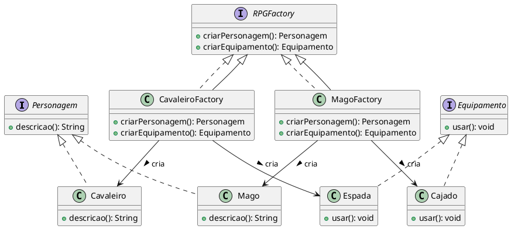

# Abstract Factory


## Brenda Gabriela Martinez Araújo (20221TADSSAJ0001) 

[@Brenda-Martinez](https://github.com/Brenda-Martinez)

<!-- @include: ../../../includes/seminario-1-Brenda-Martinez/README.md -->


## João Augusto

<figure>
  

</figure>

## Rian Fonseca
```java
public class AbstractFactory {

    // [ABSTRACT PRODUCT]
    interface Tropa {
        void atacar();
    }

    interface Construcao {
        void construir();
    }

    interface Veiculo {
        void mover();
    }

    // [CONCRETE PRODUCT] Implementações para a Idade Média
    class Cavaleiro implements Tropa {
        public void atacar() {
            System.out.println("Cavaleiro atacando com espada!");
        }
    }

    class Castelo implements Construcao {
        public void construir() {
            System.out.println("Castelo sendo construído!");
        }
    }

    class Carroca implements Veiculo {
        public void mover() {
            System.out.println("Carroça se movendo lentamente.");
        }
    }

    // [CONCRETE PRODUCT] Implementações para a Era Moderna
    class Soldado implements Tropa {
        public void atacar() {
            System.out.println("Soldado atirando com rifle!");
        }
    }

    class Predio implements Construcao {
        public void construir() {
            System.out.println("Prédio sendo construído!");
        }
    }

    class Carro implements Veiculo {
        public void mover() {
            System.out.println("Carro se movendo nas estradas.");
        }
    }

    // [ABSTRACT FACTORY]
    interface EpocaFactory {
        Tropa criarTropa();
        Construcao criarConstrucao();
        Veiculo criarVeiculo();
    }

    // [CONCRETE FACTORY] Fábrica para a Idade Média
    class MedievalFactory implements EpocaFactory {
        public Tropa criarTropa() {
            return new Cavaleiro();
        }

        public Construcao criarConstrucao() {
            return new Castelo();
        }

        public Veiculo criarVeiculo() {
            return new Carroca();
        }
    }

    // [CONCRETE FACTORY] Fábrica para a Era Moderna
    class ModernFactory implements EpocaFactory {
        public Tropa criarTropa() {
            return new Soldado();
        }

        public Construcao criarConstrucao() {
            return new Predio();
        }

        public Veiculo criarVeiculo() {
            return new Carro();
        }
    }

    // CLIENT
    public class JogoDeEstrategia {
        private Tropa tropa;
        private Construcao construcao;
        private Veiculo veiculo;

        public JogoDeEstrategia(EpocaFactory factory) {
            tropa = factory.criarTropa();
            construcao = factory.criarConstrucao();
            veiculo = factory.criarVeiculo();
        }

        public void jogar() {
            tropa.atacar();
            construcao.construir();
            veiculo.mover();
        }

        public static void main(String[] args) {
            // Construindo o jogo na Idade Média
            EpocaFactory medievalFactory = new AbstractFactory().new MedievalFactory();
            JogoDeEstrategia jogoMedieval = new AbstractFactory().new JogoDeEstrategia(medievalFactory);
            jogoMedieval.jogar();

            // Construindo o jogo na Era Moderna
            EpocaFactory modernFactory = new AbstractFactory().new ModernFactory();
            JogoDeEstrategia jogoModerno = new AbstractFactory().new JogoDeEstrategia(modernFactory);
            jogoModerno.jogar();
        }
    }
}
```
