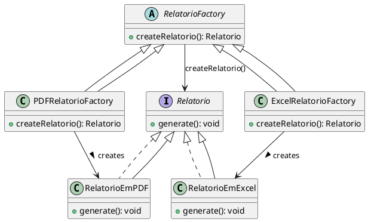

# Factory Method

## Árlei Nóbrega Oliveira (20221TADSSAJ0012)

[@Arlei10](https://github.com/Arlei10)

<!-- @include: ../../../includes/seminario-1-Arlei10/README.md -->

## José Victor Oliveira dos Santos (20212TADSSAJ0008)

[@zevictoros](https://github.com/zevictoros)

<!-- @include: ../../../includes/seminario-1-zevictoros/README.md -->

## WALLACE SELES NEVES


## Leandro

@[code](../../../includes/Leandro/factory_method/Recepcionista.java)

## João Augusto

<figure>



</figure>

## Rian Fonseca

```java
public class FactoryMethod {

    // Interface para veículos
    interface Veiculo {
        void dirigir();
    }

    // Implementação de um carro
    class Carro implements Veiculo {
        @Override
        public void dirigir() {
            // Código para dirigir um carro
            System.out.println("Dirigindo um carro.");
        }
    }

    // Implementação de uma motocicleta
    class Motocicleta implements Veiculo {
        @Override
        public void dirigir() {
            // Código para dirigir uma motocicleta
            System.out.println("Dirigindo uma motocicleta.");
        }
    }

    // Interface para fábricas de veículos
    interface FabricaDeVeiculo {
        Veiculo criarVeiculo();
    }

    // Fábrica para criar carros
    class FabricaDeCarro implements FabricaDeVeiculo {
        @Override
        public Veiculo criarVeiculo() {
            return new Carro();
        }
    }

    // Fábrica para criar motocicletas
    class FabricaDeMotocicleta implements FabricaDeVeiculo {
        @Override
        public Veiculo criarVeiculo() {
            return new Motocicleta();
        }
    }

    // Serviço de transporte que utiliza a fábrica
    class ServicoDeTransporte {
        private FabricaDeVeiculo fabrica;

        public ServicoDeTransporte(FabricaDeVeiculo fabrica) {
            this.fabrica = fabrica;
        }

        public void dirigirVeiculo() {
            Veiculo veiculo = fabrica.criarVeiculo();
            veiculo.dirigir();
        }
    }

    // Classe principal para testar o padrão Factory Method
    public static void main(String[] args) {
        // Usando a fábrica de carros
        FabricaDeVeiculo fabricaDeCarro = new FactoryMethod().new FabricaDeCarro();
        ServicoDeTransporte servicoDeCarro = new FactoryMethod().new ServicoDeTransporte(fabricaDeCarro);
        servicoDeCarro.dirigirVeiculo();

        // Usando a fábrica de motocicletas
        FabricaDeVeiculo fabricaDeMotocicleta = new FactoryMethod().new FabricaDeMotocicleta();
        ServicoDeTransporte servicoDeMotocicleta = new FactoryMethod().new ServicoDeTransporte(fabricaDeMotocicleta);
        servicoDeMotocicleta.dirigirVeiculo();
    }
}
```
